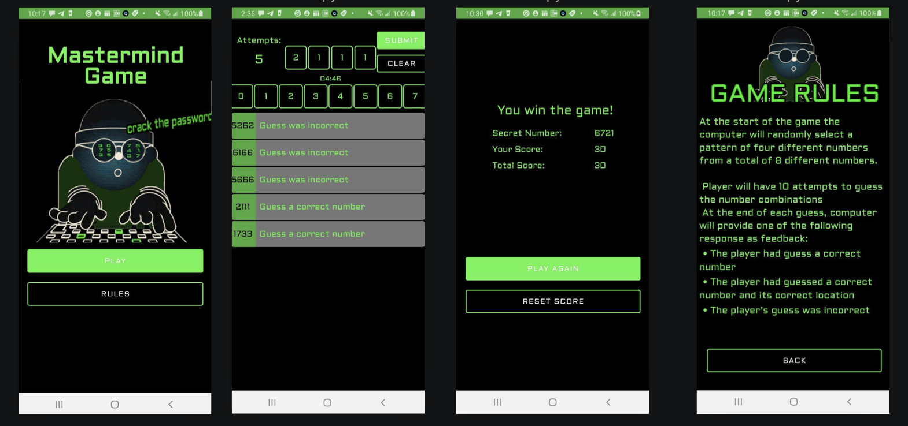

# Mastermind Game

 Mastermind game, which can be played by a user "against" the computer. This is a game where a player tries to guess the numberc ombinations.
 At the end of each attempt to guess the 4 number combinations, the computer will provide feedback whether the player had guess a number correctly, 
 or/and a number and digit correctly. A player must guess the right number combinations within 10 attempts to win the game.


 ## Game rules

At the start of the game the computer will randomly select a pattern of four different numbers from a total of 8 different numbers.
A player will have 10 attempts to guess the number combinations and only 5 minutes.
At the end of each guess, computer will provide one of the following response
as feedback:
- The player had guess a correct number
- The player had guessed a correct number and its correct location
- The player’s guess was incorrect

## Getting Started

- Clone the repo and install the dependencies.

```bash
git clone https://github.com/SvitlanaAno/MastermindGame.git
```

- Open Android Studio and create a new project from the just downloaded source.

- Run the app on an emulator or directly on a device.

## Project Overview
The app is implementing the MVVM pattern and consists:

Four Screens, each screen is implemented as a Fragment
- TitleFragment - dispalys screen with play button and rules button.
- GameFragment -  dispalys available for selection number 0-7( in the aspect of UI view the number are fixed) and combinations of 4 selected numbers, the number of guesses left and a timer, also dispalys a list of all the  history of guesses and their feedback. 
- ResultFragment - dispalys score of the current game and total score of user games, and restart an reset button.
- Rules Fragment - displays the overal rules how to play the game.

Two ViewModels
- GameViewModel - consist mastermind game logic.
- ResultViewModel - consist logic to retrieve current score value using Safe Args and user total game score value from Preferences DataStore.

Model and Network packages includes:
- Guess - data class for creating guesses objects.
- UserPreference - class Creating, observing from and writing user total game score to a preferences dataStore.
- SecretNumberApiService -  for making api calls to an HTTP web service and retrieve Secret random number.


### The Mastermind game app builds on the following techniques:
* Navigation component within Jetpack to move the user between different screens.
* Transformation map
* Data Binding in XML files
* ViewModel Factory
* Using Backing Properties to protect MutableLiveData
* Observable state LiveData variables to trigger navigation


## Libraries used in this project
- [Android architecture components](https://developer.android.com/topic/libraries/architecture/index.html)
- [ViewModel](https://developer.android.com/topic/libraries/architecture/viewmodel.html)
- [LiveData](https://developer.android.com/topic/libraries/architecture/livedata.html)
- [DataStore](https://developer.android.com/topic/libraries/architecture/datastore.html) 
- [Retrofit](https://github.com/square/retrofit)

## API Integration
Use Random Number Generator API (https://www.random.org/clients/http/api/) to generate the number combinations.

## Screenshots


## Potential Enhancements
-  add tests
-  add view to guess history to show how many number correct and on the right position
-  add settings screen for difficulty level selection
-  add animation on the result screen


